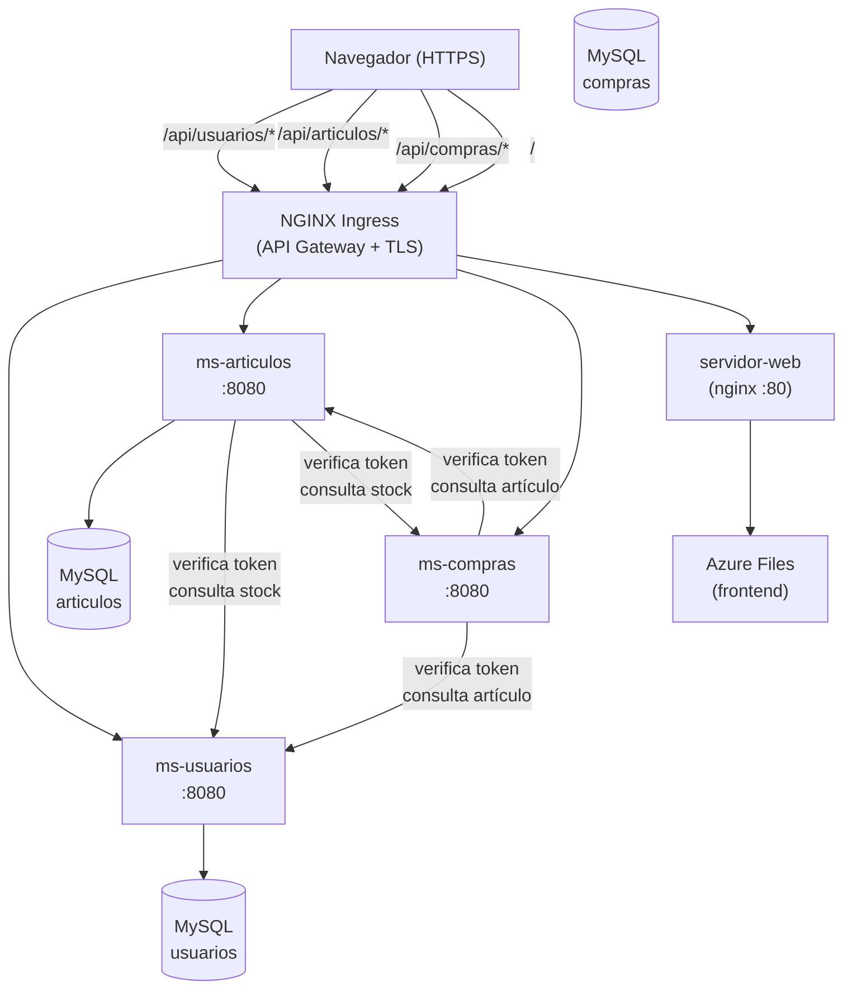

# ecommerce-microservices-kubernetes

Sistema de e-commerce implementado con tres microservicios Java/JAX-RS independientes, desplegados en Azure Kubernetes Service (AKS) con NGINX Ingress como API gateway y certificado TLS automático vía cert-manager + Let's Encrypt.

## Stack tecnológico

- **Lenguaje backend:** Java 8, JAX-RS (Jersey), Tomcat 9
- **Base de datos:** MySQL 8 — Azure Database for MySQL Flexible Server (una BD por microservicio)
- **Contenerización:** Docker (imagen base `tomcat:9-jdk8`)
- **Orquestación:** Kubernetes (AKS), NGINX Ingress Controller
- **TLS:** cert-manager + Let's Encrypt (challenge HTTP-01)
- **Almacenamiento frontend:** Azure Files (PersistentVolume CSI)
- **Frontend:** HTML5 + JavaScript vanilla + `WSClient.js` (cliente HTTP genérico)

## Arquitectura

El sistema expone un único punto de entrada HTTPS a través del NGINX Ingress Controller, que enruta por prefijo de ruta hacia cada microservicio. Cada microservicio tiene su propia base de datos MySQL. La comunicación entre servicios (validación de token, consulta de artículos desde compras) ocurre vía HTTP interno usando los nombres de Service de Kubernetes.



## Funcionalidades implementadas

- **ms-usuarios:** alta, consulta, modificación y baja de usuario; foto de perfil como BLOB; login con token de sesión; endpoint `verifica_acceso` consumido por otros microservicios
- **ms-articulos:** alta de artículo con foto; consulta de catálogo; validación de acceso delegada a ms-usuarios; consulta de stock hacia ms-compras
- **ms-compras:** agregar artículo al carrito, consultar carrito (enriquecido con nombre/precio/imagen desde ms-articulos), eliminar artículo del carrito, vaciar carrito, ejecutar compra
- **API Gateway:** enrutamiento path-based (`/api/usuarios/*`, `/api/articulos/*`, `/api/compras/*`) sin exponer los puertos internos
- **Frontend:** interfaz HTML/JS que consume los tres microservicios vía rutas relativas, sin URLs hardcodeadas

## Estructura del repositorio

```
codigo_backend/
  usuarios/         Servicio.java, Usuario.java, Respuesta.java, context.xml
  articulos/        Servicio.java, Articulo.java, Respuesta.java, context.xml
  compras/          Servicio.java, ArticuloCantidad.java, Respuesta.java, context.xml
codigo_frontend/
  prueba.html       Interfaz principal (gestión de usuarios, artículos y compras)
  WSClient.js       Cliente HTTP genérico (GET/POST/PUT/DELETE)
  index.html        Página de entrada
dockerfiles/
  Dockerfile.*      Un Dockerfile por microservicio y servidor web
kubernetes/
  despliegue.yaml   Deployments y Services de los 4 contenedores
  ingress.yaml      Ingress rules con rewrite de rutas
  secreto.yaml      Secret de Azure Files (valores sanitizados en este repo)
  cert-manager-issuer.yaml  ClusterIssuer para Let's Encrypt
scripts_sql/
  bdgu_usuarios.sql
  bdga_articulos.sql
  bdgc_compras.sql
nginx.conf          Configuración del API Gateway NGINX
README.md
.gitignore
```

## Decisiones de diseño destacables

1. **Base de datos por microservicio:** cada servicio tiene su propio schema MySQL (`bdgu_usuarios`, `bdga_articulos`, `bdgc_compras`). Esto garantiza aislamiento de datos y permite evolucionar el schema de cada servicio de forma independiente, a costa de no poder hacer JOINs entre servicios.

2. **Compensación entre servicios (patrón Saga):** la operación de compra en `ms-compras` valida el token contra `ms-usuarios` y consulta disponibilidad a `ms-articulos` antes de comprometer la transacción local. Si alguna llamada HTTP externa falla (timeout de 8 s), la operación aborta limpiamente sin dejar datos inconsistentes.

3. **Certificado TLS automático con cert-manager:** en lugar de gestionar manualmente certificados SSL, `cert-manager` observa el recurso `ClusterIssuer` y renueva el certificado Let's Encrypt antes de su vencimiento, sin intervención manual. La renovación se describe en `RENOVAR_CERTIFICADO.md` del proyecto original.

4. **Control de costos en AKS:** el clúster se detiene fuera de horas de uso con un script PowerShell (`az aks stop`), eliminando el costo de VM pero conservando la configuración. Al retomar, un `az aks start` restaura el estado completo en ~3 minutos.

## Nota académica

Proyecto universitario desarrollado para la materia **Sistemas Distribuidos** en ESCOM-IPN. Las credenciales reales de base de datos, la Storage Account Key y el email de contacto de cert-manager fueron removidos del código fuente público y reemplazados por placeholders entre `< >`.

