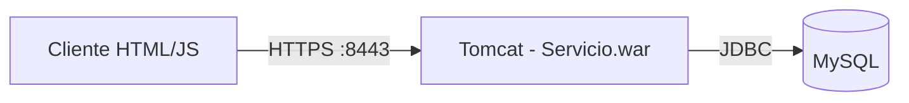

# T7 — API REST de comercio electrónico sobre VM con Tomcat y MySQL

Servicio web REST en Java (JAX-RS/Jersey) desplegado en una máquina virtual de Azure,
con persistencia en MySQL y comunicación cifrada vía HTTPS.

## Stack tecnológico

- **Java** con **JAX-RS (Jersey)** sobre **Apache Tomcat**
- **MySQL** como base de datos relacional
- **HTTPS** (puerto 8443) sobre la VM de Azure
- **Jackson** para serialización JSON
- Front-end en HTML/JavaScript vanilla, consumiendo el servicio vía `fetch`

## Arquitectura

Una sola máquina virtual aloja tanto el servidor de aplicaciones (Tomcat, sirviendo el
WAR `Servicio.war`) como el motor de base de datos (MySQL), siguiendo una arquitectura de
3 capas clásica (cliente → servidor de aplicación → base de datos) dentro de un único
host. El cliente HTML estático consume el servicio REST a través de HTTPS.



## Funcionalidades implementadas

**Backend (gestión de usuarios):**
- `login` — autenticación con email y password, genera token de sesión
- `alta_usuario` — registro de nuevo usuario
- `consulta_usuario` — obtener datos del perfil
- `modifica_usuario` — actualizar perfil (incluye foto)
- `borra_usuario` — eliminar cuenta

**Backend (gestión de artículos y carrito):**
- `alta_articulo` — publicar un artículo en venta
- `consulta_articulos` — búsqueda de artículos por palabra clave
- `compra_articulo` — agregar artículo al carrito, validando stock disponible
- `elimina_articulo_carrito_compra` — quitar un artículo del carrito
- `elimina_carrito_compra` — vaciar el carrito completo

**Frontend:**
- Registro e inicio de sesión de usuarios
- Edición de perfil (incluida foto)
- Publicación y búsqueda de artículos
- Carrito de compras con validación de stock disponible

## Estructura del repositorio

```
backend/
├── Servicio.java     Clase principal del servicio REST (todos los endpoints)
├── Usuario.java       Modelo de datos de usuario
├── Articulo.java       Modelo de datos de artículo
├── Respuesta.java       Modelo genérico de respuesta del API
├── web.xml               Configuración del servlet Jersey
├── context.xml            Configuración del datasource JDBC (plantilla, sin credenciales)
├── compila.sh / compila.bat   Scripts de compilación del WAR
frontend/
├── prueba.html         Interfaz de usuario
├── WSClient.js          Cliente JavaScript para consumir el API REST
├── usuario_sin_foto.png  Imagen de perfil por defecto
database/
└── crear_tablas.sql    Script de creación de esquema y datos de prueba
```

## Decisiones de diseño destacables

- **Control de acceso por token**: cada operación que requiere sesión (excepto `login` y
  `alta_usuario`) valida un token generado en el login y almacenado junto al usuario en
  base de datos, en vez de depender únicamente del lado del cliente.
- **Transacciones explícitas**: las operaciones que modifican stock y carrito de compra
  (`compra_articulo`, `elimina_articulo_carrito_compra`, `elimina_carrito_compra`) usan
  commits/rollbacks manuales para mantener la consistencia entre las tablas `stock` y
  `carrito_compra` ante errores a mitad de operación.
- **Validación de stock en servidor**: `compra_articulo` rechaza la operación si la
  cantidad solicitada excede el stock disponible, devolviendo un mensaje de error claro
  en vez de permitir cantidades negativas.
- **HTTPS de extremo a extremo**: el servicio corre exclusivamente sobre el puerto 8443
  con TLS, en vez de exponer HTTP sin cifrar.

## Nota académica

Proyecto desarrollado como parte del curso de Sistemas Distribuidos / Cómputo en la Nube,
ESCOM-IPN. Las credenciales reales de conexión a la base de datos fueron removidas del
código fuente público (`context.xml` se entrega como plantilla sin usuario ni contraseña).

## Contacto

<tu LinkedIn aquí>
